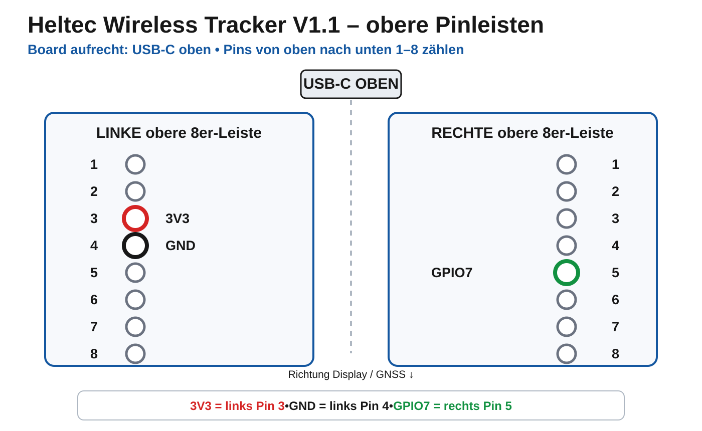
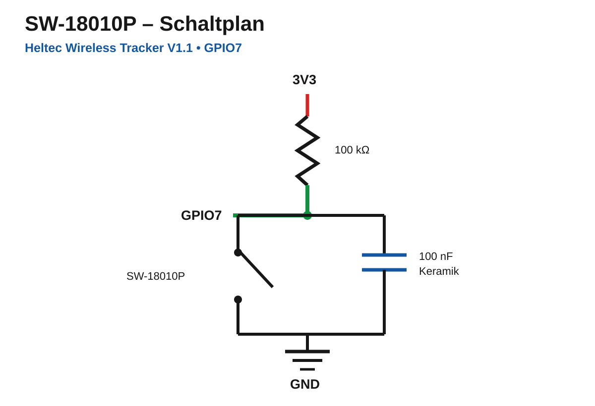
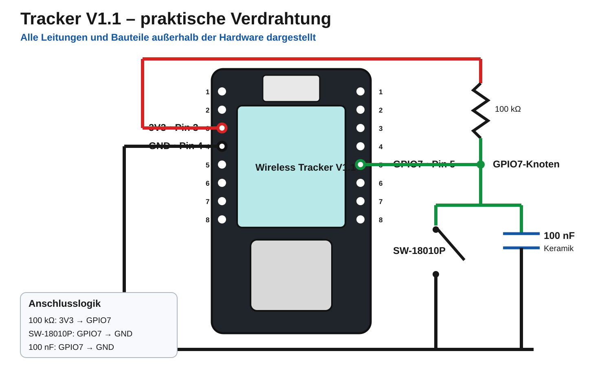

# Heltec Wireless Tracker V1.1 - Verkabelung

Diese Verkabelung gilt für beide Tracker-V1.1-Rollen in diesem Branch:

- `TAK_TRACKER` - autonomer Kfz-Tracker mit SW-18010P und Park-Deep-Sleep.
- `TAK` - Führungselement mit Motion-Wakeup aus Light Sleep und ATAK/Bluetooth-Service auf Tastendruck.

Beide Rollen verwenden denselben Bewegungseingang auf `GPIO7`. Der onboard USER-/Service-Taster bleibt `GPIO0`.

**GPIO0 öffnet bei beiden Rollen Bluetooth und das lokale Service-/Einstellmenü.** Die Bedienung und die einstellbaren Feldparameter sind separat dokumentiert: [Tracker V1.1 Service- und Einstellmenü](heltec-tracker-v11-service-menu.md).

## 1. Exakte Pinbelegung

Die folgende Grafik ist bewusst als **reine Vektorgrafik ohne eingebettetes Foto** aufgebaut. Dadurch wird sie auch in der GitHub-App bzw. auf iPhone/iPad zuverlässig dargestellt:

### Offizielle Heltec-Pinmap zum optischen Abgleich

Für alle Geräte dieses Projekts verwenden wir bewusst immer dieselben drei Anschlüsse. Das Board wird dabei **aufrecht mit USB-C oben** betrachtet; die oberen 8 Pins jeder Seite werden **von oben nach unten** gezählt:

| Funktion             | Anschluss                                      |
| -------------------- | ---------------------------------------------- |
| `3V3`                | linke obere 8er-Pinleiste, **Pin 3 von oben**  |
| `GND`                | linke obere 8er-Pinleiste, **Pin 4 von oben**  |
| `GPIO7`              | rechte obere 8er-Pinleiste, **Pin 5 von oben** |
| USER-/Service-Taster | onboard `GPIO0`, keine zusätzliche Leitung     |

`GPIO7` darf nicht als Meshtastic-Button konfiguriert werden. `device.button_gpio` bleibt auf `GPIO0`.

## 2. Schaltung des SW-18010P

Die Verdrahtung ist:

- **100 kΩ Widerstand:** zwischen `3V3` und `GPIO7` als Pull-up.
- **SW-18010P:** zwischen `GPIO7` und `GND`.
- **100 nF Keramikkondensator:** ebenfalls zwischen `GPIO7` und `GND`, also **parallel zum SW-18010P**.

Der SW-18010P ist ein passiver zweipoliger Vibrationsschalter und hat keine Polung. Der 100-nF-Keramikkondensator ist ebenfalls unpolarisiert.

Im Ruhezustand ist der SW-18010P offen und der 100-kΩ-Widerstand zieht `GPIO7` auf HIGH. Bei Erschütterung schließt der SW-18010P kurz nach GND und zieht `GPIO7` auf LOW. Der Kondensator überbrückt den Schalter nicht dauerhaft: nach dem Aufladen fließt bei Gleichspannung praktisch kein Dauerstrom durch ihn. Er filtert sehr kurze Kontakt- und Störimpulse.

Mit 100 kΩ und 100 nF beträgt die RC-Zeitkonstante ungefähr **10 ms**. Wenn der SW-18010P geschlossen ist, fließen über den 100-kΩ-Pull-up bei 3,3 V ungefähr **33 µA**.

## 3. Praktische Verdrahtung

Die Praxisgrafik ist bewusst vereinfacht und zeigt die Bauteile außerhalb des Boards, damit keine Leitung einen Anschluss oder die Hardware verdeckt:

1. Von **3V3 / links Pin 3** zum 100-kΩ-Widerstand.
2. Vom anderen Ende des 100-kΩ-Widerstands zum gemeinsamen **GPIO7-Knoten**.
3. **GPIO7 / rechts Pin 5** direkt mit diesem GPIO7-Knoten verbinden.
4. Vom GPIO7-Knoten je einen Zweig zum SW-18010P und zum 100-nF-Kondensator führen.
5. Die jeweils andere Seite von SW-18010P und Kondensator mit **GND / links Pin 4** verbinden.

Damit liegen SW-18010P und 100 nF parallel zwischen `GPIO7` und `GND`, während der 100-kΩ-Widerstand von `3V3` zum `GPIO7`-Knoten führt.

## Einbaukontrolle

Vor dem Schließen des Gehäuses:

1. LoRa-Antenne anschließen und den Tracker einschalten.
2. Prüfen, dass `GPIO7` bei ruhendem Sensor HIGH ist.
3. Sensor antippen bzw. bewegen und prüfen, dass LOW-Pulse an `GPIO7` entstehen.
4. Prüfen, dass der onboard USER-Taster weiterhin `GPIO0` für den Service-Modus verwendet.
5. Sicherstellen, dass `3V3` niemals direkt über den SW-18010P nach GND geführt wird - der **100-kΩ-Widerstand muss zwischen 3V3 und GPIO7 liegen**.
6. Den SW-18010P so befestigen, dass Fahrzeugvibrationen auf ihn übertragen werden, ohne den Sensorkörper mechanisch vollständig zu blockieren.

## Verhalten der beiden Rollen

### `TAK_TRACKER`

`GPIO7` weckt den Tracker aus dem geparkten Deep Sleep. Standardmäßig bestätigt die Firmware Bewegung nach **2 fallenden Flanken innerhalb von 3 Sekunden** (`NORMAL`). Die Empfindlichkeit kann im GPIO0-Service-Menü verändert werden. Nach 120 Sekunden ohne bestätigte Bewegung wird die abschließende Position verarbeitet und anschließend wieder geparkt geschlafen.

Smart Position verwendet standardmäßig **75 m Mindeststrecke und 30 s Mindestintervall**. Das geparkte Timer-Intervall beträgt standardmäßig **60 Minuten**. Alle drei Werte sind im lokalen Service-Menü einstellbar.

Bewegung selbst schaltet Bluetooth **nicht** ein. Bluetooth wird nur nach einem bewussten Druck auf GPIO0 für das Servicefenster aktiviert.

### `TAK`

`GPIO7` ist ein Light-Sleep-Wakeup. Bei bestätigter Bewegung bleibt die CPU für GNSS und PositionModule verfügbar. Die gleichen Motion-, Distanz- und Zeitwerte wie beim `TAK_TRACKER` werden verwendet und können über GPIO0 eingestellt werden. Das stationäre autonome Heartbeat-Intervall ist ebenfalls einstellbar und beträgt standardmäßig 60 Minuten.

Bluetooth und Display bleiben bei reiner Bewegung aus. GPIO0 öffnet das ATAK/Bluetooth- und Einstellfenster.

## Stückliste

- 1× Heltec Wireless Tracker V1.1
- 1× SW-18010P
- 1× 100-kΩ-Widerstand
- 1× 100-nF-Keramikkondensator
- Leitungen / geeignete Steckverbinder
- passende 868-MHz-LoRa-Antenne
