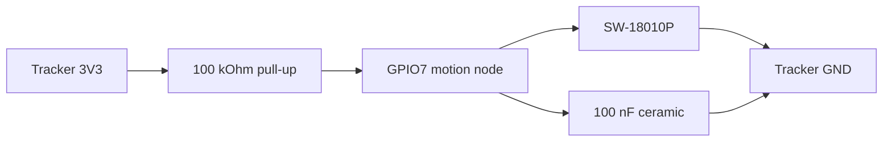

# Heltec Wireless Tracker V1.1 wiring

This is the hardware wiring used by both Tracker V1.1 field roles in this branch:

- `TAK_TRACKER` — autonomous Kfz tracker with parked deep sleep.
- `TAK` — leadership element with LoRa/GNSS light sleep and ATAK Bluetooth service on demand.

Both roles use the same SW-18010P motion input on GPIO7. GPIO0 remains the onboard USER/service button.

## Official Heltec pin map


Official Heltec source: `Wireless Tracker Pin Map` from the Heltec Wireless Tracker documentation/resources.

## Exact pins to use

With the board oriented like the official pin map (USB-C and display at the top/left, GNSS antenna at the lower/right):

| Connection | Tracker V1.1 physical header position | Signal |
|---|---|---|
| Sensor supply | upper-left 8-pin power header, pin 3 **or** pin 5 | `3V3` |
| Ground | upper-left 8-pin power header, pin 2 / 4 / 6 / 8 | `GND` |
| Motion input | upper-right 8-pin header, pin 5 | `GPIO7` |
| User/service button | onboard USER button | `GPIO0` |

Recommended practical choice: use upper-left power-header **pin 3 = 3V3**, **pin 4 = GND**, and upper-right header **pin 5 = GPIO7**. This keeps the three external wires close together and easy to identify.

> Do **not** configure GPIO7 as the Meshtastic button pin. `device.button_gpio` stays at GPIO0.

## SW-18010P circuit

The SW-18010P is used as a passive two-terminal vibration switch. It is not polarized.



Electrical behavior:

- stationary/open sensor: GPIO7 is pulled **HIGH** through 100 kOhm;
- vibration closes the SW-18010P: GPIO7 is pulled **LOW**;
- the 100 nF ceramic capacitor suppresses very short contact chatter and makes the 3-pulses-in-3-seconds confirmation more repeatable;
- use a ceramic/non-polarized 100 nF capacitor.

## Point-to-point wiring

```text
Tracker V1.1                         SW-18010P

3V3 pin 3 (or 5) ----[ 100 kOhm ]----+---- GPIO7 (upper-right pin 5)
                                      |
                                      +----[ 100 nF ]---- GND
                                      |
                                      +---- SW-18010P ---- GND

GPIO0 = onboard USER button only; no external motion wire goes to GPIO0.
```

## Battery / power

The Tracker V1.1 is powered from the normal onboard battery connection used by the board. For this project the external pack is a 1S lithium pack. Do not feed raw multi-cell vehicle/drone battery voltage into the Tracker battery input.

For USB service/debugging, USB power intentionally suppresses the managed parked deep-sleep behavior in the vehicle profile.

## Installation checks before closing the enclosure

1. Power the board with the LoRa antenna connected.
2. Verify GPIO7 reads HIGH when the sensor is still.
3. Tap/vibrate the sensor and verify GPIO7 produces LOW pulses.
4. Confirm the onboard USER button still acts as GPIO0 service input.
5. Confirm 3V3 is never shorted directly to GND through the sensor; the sensor must connect from the **GPIO7 node** to GND, with the 100 kOhm resistor between 3V3 and that node.
6. Mechanically secure the SW-18010P so vehicle vibration reaches it, but do not rigidly clamp the sensing body so hard that it cannot react.

## Role-specific use

### `TAK_TRACKER`

GPIO7 wakes the unit from parked deep sleep. The firmware requires 3 falling edges within 3 seconds before movement is confirmed. After 120 seconds without confirmed movement it sends the final position and returns to parked deep sleep.

### `TAK`

GPIO7 is a light-sleep wake source. LoRa stays receive-capable while stationary; vibration wakes the ESP32 and confirmed movement keeps the GNSS/PositionModule active for the 75 m / 30 s smart-position policy. GPIO0 opens the intentional ATAK/Bluetooth service window.

## Parts

- 1x Heltec Wireless Tracker V1.1
- 1x SW-18010P vibration switch
- 1x 100 kOhm resistor
- 1x 100 nF ceramic capacitor
- wire / connector suitable for the enclosure
- 868 MHz LoRa antenna connected to the board antenna port
