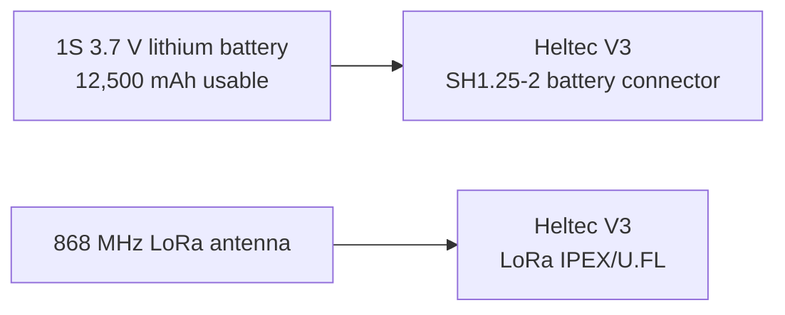

# Heltec WiFi LoRa 32 V3 repeater wiring

This branch uses the Heltec V3 only as the low-power LoRa infrastructure/repeater node (`ROUTER_LATE` recommended).

**The V3 repeater does not use a SW-18010P motion sensor. No GPIO wiring is required for normal repeater operation.**

## Official Heltec V3 pin map


The official Heltec V3 board uses the ESP32-S3 and SX1262 and provides an onboard SH1.25-2 lithium-battery connector plus the LoRa IPEX/U.FL antenna connector.

## Required connections

Only two external connections are required for the battery-powered repeater:



| Connection | V3 connection | Required? |
|---|---|---|
| 1S lithium battery | onboard SH1.25-2 battery connector | yes for battery operation |
| 868 MHz LoRa antenna | LoRa IPEX/U.FL connector | **yes** |
| USB-C | service/flashing/bench power only | optional |
| SW-18010P | none | **no** |
| GPIO7 | none | **no** |
| external GPS | none | no |

## What must remain unconnected

For the normal repeater build, leave the GPIO headers alone. In particular there is no reason to connect GPIO7 or to reproduce the Tracker V1.1 motion-sensor circuit on the V3.

The repeater wakes from ESP32 light sleep through LoRa activity. The SX1262 remains the relevant wake source; vehicle movement is irrelevant to this role.

## Battery connection

For this project the repeater battery is a **1S 3.7 V lithium pack with 12,500 mAh usable capacity** connected to the V3 battery input.

- Use the onboard SH1.25-2 battery connector for the 1S pack.
- Verify connector polarity against the board markings/schematic before first connection; pre-wired SH1.25 leads are not guaranteed to use the same wire colors/polarity.
- Do not connect a raw multi-cell vehicle/drone pack directly to the V3 battery connector.
- USB-C may be used for flashing and bench servicing.

## LoRa antenna

Connect a suitable **EU 868 MHz** antenna to the LoRa IPEX/U.FL connector before normal radio operation.

- Do not intentionally transmit without the LoRa antenna connected.
- Keep the antenna clear of large metal surfaces where practical.
- For a fixed repeater, mount the antenna vertically and as high/clear as practical.

## Why there is no motion sensor

The old V3 vehicle-tracker concept needed GPIO7 movement detection because the whole vehicle node could sleep while parked. That is no longer the V3 role.

The current V3 is infrastructure:

```text
LoRa listening -> packet received -> ESP32 wakes -> packet processed/rebroadcast -> light sleep
```

Bluetooth, Wi-Fi, display and heartbeat LED are disabled by the repeater profile. The LoRa receiver remains available to wake the processor, so adding a vibration sensor would provide no useful repeater function and would only add wiring and another possible failure point.

## Minimal installation checklist

1. Flash the `heltec-v3-repeater-light-sleep` firmware.
2. Connect the 868 MHz LoRa antenna.
3. Connect the 1S 3.7 V battery with verified polarity.
4. Set the device role to `ROUTER_LATE`.
5. Use the same EU_868 LoRa/channel settings as the rest of the mesh.
6. Leave all external GPIOs, including GPIO7, unconnected unless a future feature explicitly requires them.
