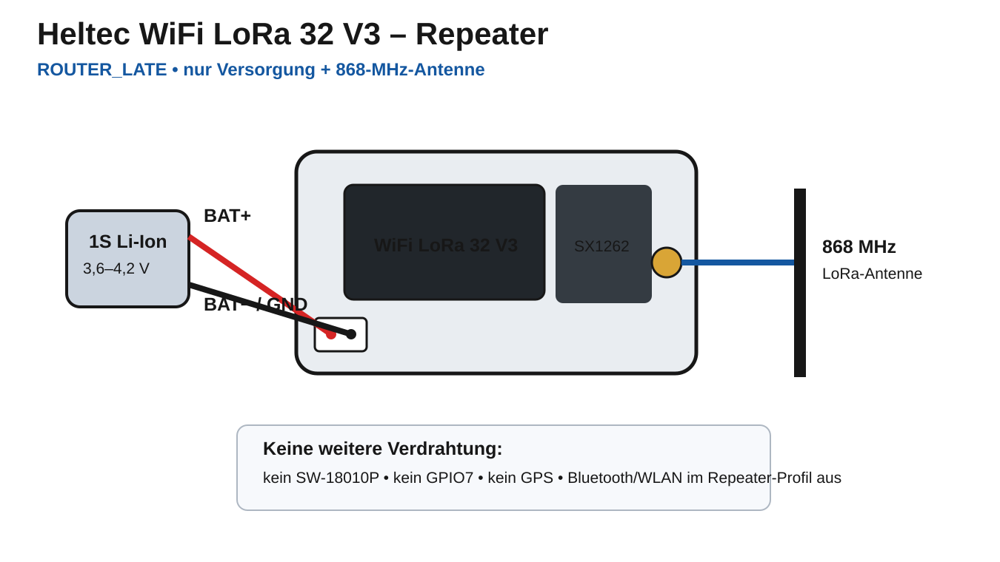

# Heltec WiFi LoRa 32 V3 - Repeater-Verkabelung

Dieser Branch verwendet den Heltec WiFi LoRa 32 V3 ausschließlich als stromsparenden LoRa-Infrastruktur-/Repeater-Knoten. Empfohlene Rolle ist `ROUTER_LATE`.

**Der V3-Repeater benötigt keinen SW-18010P, kein GPIO7 und kein GPS.**

## Verdrahtung

Für den normalen Repeater-Betrieb sind nur zwei externe Anschlüsse erforderlich:

- **1S Li-Ion/LiPo-Akku** am normalen Batterieanschluss des V3.
- **868-MHz-LoRa-Antenne** am LoRa-Antennenanschluss.

Der für dieses Projekt verwendete Repeater-Akku hat **12.500 mAh nutzbare Kapazität** und ist ein 1S-Lithium-Akku. Vor dem ersten Anschluss muss die Polarität des verwendeten Steckers gegen Boardmarkierung bzw. Schaltplan geprüft werden.

## Nicht anschließen

Für diesen Repeater bleiben die GPIO-Leisten unbenutzt:

- kein SW-18010P
- kein GPIO7
- kein externer Bewegungssensor
- kein externes GPS

Der V3 ist kein Fahrzeugtracker mehr. Er bleibt über den SX1262 auf LoRa empfangsbereit; ein eingehendes LoRa-Ereignis kann den ESP32-S3 aus dem Light Sleep holen, das Paket wird verarbeitet bzw. weitergeleitet und anschließend kann die CPU wieder in Light Sleep gehen.

## Repeater-Profil

Die Firmware setzt im Repeater-Profil unter anderem:

- Rolle `ROUTER_LATE` empfohlen
- Power Saving EIN
- Bluetooth AUS
- Wi-Fi AUS
- Display AUS
- Heartbeat-LED AUS
- kein eigener Deep-Sleep-Fahrzeugmodus

## Einbaukontrolle

1. Zuerst die passende 868-MHz-LoRa-Antenne anschließen.
2. Akku-Polung kontrollieren.
3. 1S-Lithium-Akku anschließen.
4. Firmware `heltec-v3-repeater-light-sleep` verwenden.
5. Rolle `ROUTER_LATE` setzen.
6. Dieselben EU_868-/Kanal-/PSK-Einstellungen wie im restlichen Mesh verwenden.
7. Alle GPIOs unbeschaltet lassen, solange keine spätere Funktion sie ausdrücklich benötigt.
